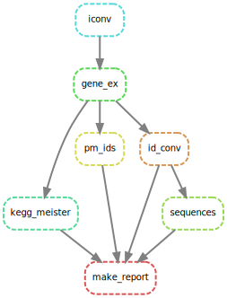

# Snakemake course 11

In this course the aim was to create a pipeline for the retrieval of biological information for the provided 'RNA-Seq-counts.txt'.  We created a pipeline in Snakemake to retrieve pubmed protein sequences, kegg pathways, gene functions and gene names for each gene id in 'RNA-Seq-counts'. Besides this the pipeline also retrieves database accession codes for pubmed, uniprot, ncbi protein and ncbi gene. The workflow of this pipeline is shown below.



This workflow can be created using the snakemake pipeline as well.

## Installation
For running this pipeline a few dependencies (main dependencies listed below) should be installed on your system, for this reason a 'environment.yaml' file is provided in the scripts section of this repository. To create the right environment the following line of code should be executed in your terminal.

```conda env create -n <env name> -f scripts/environment.yaml```

to activate the environment run:

```source activate <env name>```

The <env name> tag should be replaced with the name you want to give the environment.
  
### Dependencies
- [conda](https://conda.io/docs/)
- [mygene](http://mygene.info/) >= 3.0.0: Xin J, Mark A, Afrasiabi C, Tsueng G, Juchler M, Gopal N, Stupp GS, Putman TE, Ainscough BJ, Griffith OL, Torkamani A, Whetzel PL, Mungall CJ, Mooney SD, Su AI, Wu C (2016) High-performance web services for querying gene and variant annotation. Genome Biology 17(1):1-7
- [biopython](https://biopython.org/) >= 1.71: Cock, P. J., Antao, T., Chang, J. T., Chapman, B. A., Cox, C. J., Dalke, A., ... & De Hoon, M. J. (2009). Biopython: freely available Python tools for computational molecular biology and bioinformatics. Bioinformatics, 25(11), 1422-1423.
- [snakemake](https://snakemake.readthedocs.io/en/stable/) >= 4.0.0: Köster, J., & Rahmann, S. (2012). Snakemake—a scalable bioinformatics workflow engine. Bioinformatics, 28(19), 2520-2522.


## Running

To execute the snakemake pipeline clone this github repository to your system in a folder. Go to this folder and make sure you activated your created environment, then run the following command:

```snakemake -s scripts/Snakefile make_report```

The output generated will appear in your folder in a directory 'output'.

## Output

As an example the output report of this pipeline has been included in this repository under the name 'report.txt' which is a tab separated file loadable in excel or libre office. This report contains the information retrieved for the first 80 gene identifiers in 'RNA-Seq-counts.txt'.
